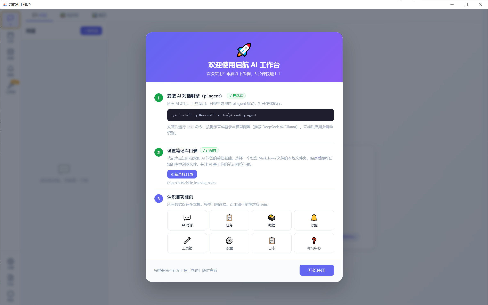
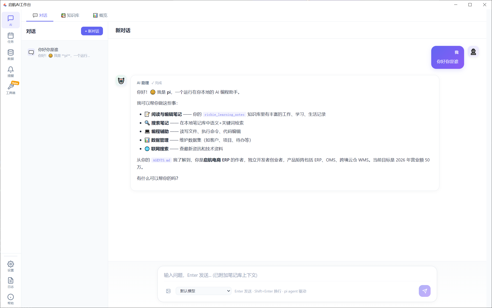
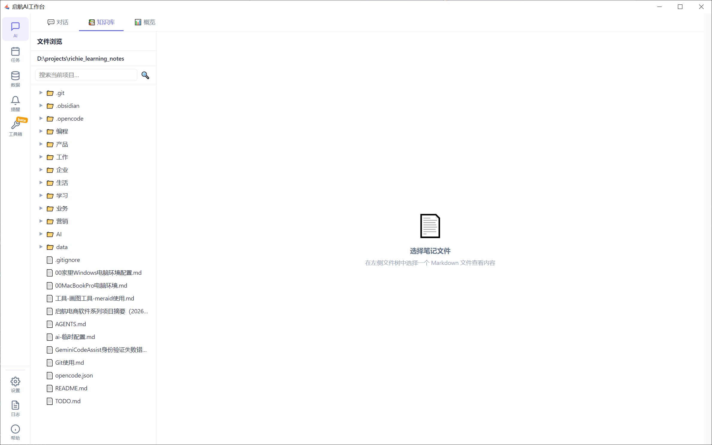
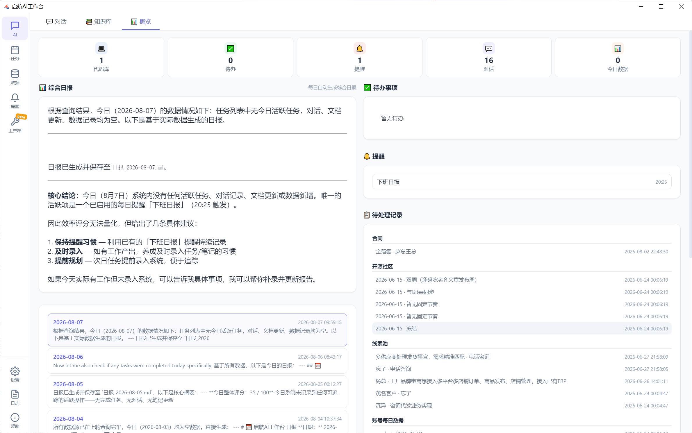
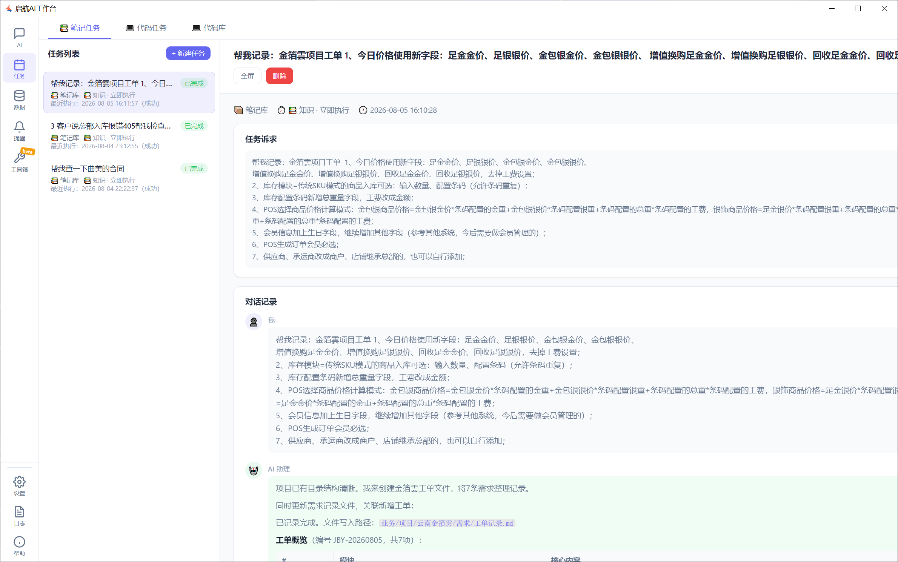
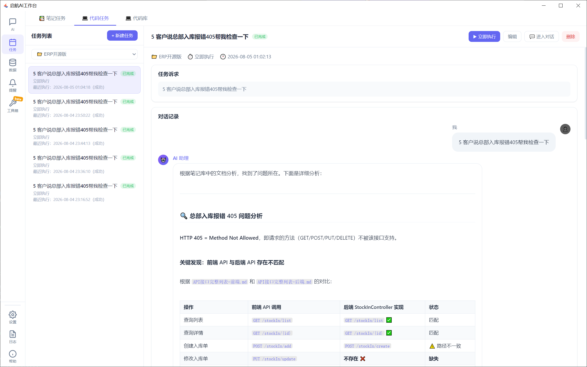
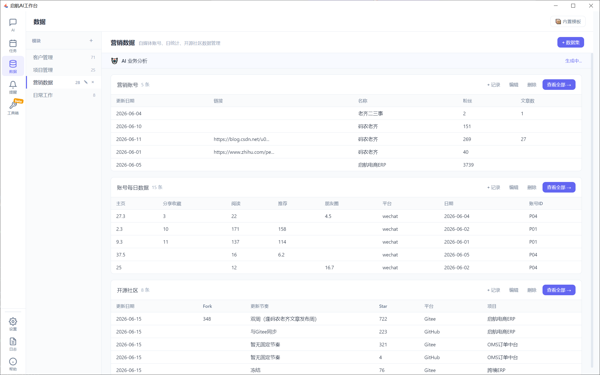
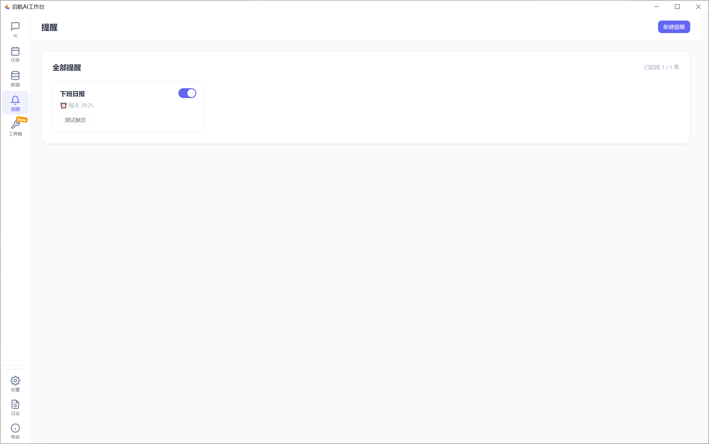
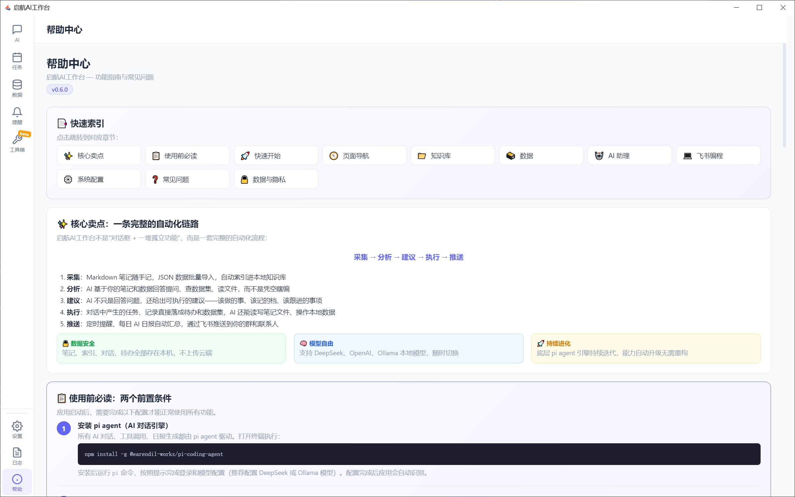

# 我用一个月做了一款「不联网也能用」的 AI 工作台：笔记、待办、数据、编程全打通，数据全留本机

> 你有没有这种感觉：用了大半年的 AI 工具，聊天记录散在好几个 App 里，待办事项还是得靠备忘录，数据集永远在 Excel 里躺尸，AI 给的建议听完就忘？
>
> 问题不在 AI 不够聪明，而在 **AI 没有真正接入你的数据流**。

今天给大家安利一款我自用的开源桌面应用——**启航AI工作台（Qihang AI Desktop）**。它不是又一个 ChatGPT 套壳，而是一款以「数据流为核心」的本地 AI 助手：你的笔记、待办、工作数据全部留在本机，AI 介入到「采集 → 分析 → 建议 → 执行 → 推送」的每一个环节。



---

## 一、为什么我们需要一款「本地优先」的 AI 工作台？

市面上的 AI 工具大致分两类：

- **云端 SaaS**：功能强大，但数据要上传，月费还不便宜；
- **本地模型**：数据安全，但配起来劝退，功能也常常只有「聊天」一个窗口。

启航AI工作台想做的事情很直接——**让 AI 真正用上你的数据，同时数据一刻也不离开你的电脑**。

- 笔记、待办、数据集全部存本地 SQLite；
- 对话模型可以自由选 DeepSeek、OpenAI 兼容接口，甚至 Ollama 本地模型；
- 配上 Ollama 后，**除软件自动更新外无任何网络请求**，完全离线可用。

更关键的是，它把「AI 对话」从孤立的聊天窗口，变成了整条工作流的入口。

---

## 二、核心亮点：一条完整的自动化链路

```
采集 → 分析 → 建议 → 执行 → 推送
```

这不是一句口号，而是软件里真实跑通的链路：

1. **采集**：Markdown 笔记随手记，JSON 数据批量导入，自动索引进本地知识库；
2. **分析**：AI 基于你的笔记和数据回答提问，而不是凭空瞎编；
3. **建议**：AI 不只回答问题，还给出「该做什么、该记什么、该跟进谁」的可执行建议；
4. **执行**：对话里产生的任务、记录直接落成待办和数据集，AI 还能读写笔记、操作本地数据、在隔离 Git worktree 里改代码；
5. **推送**：定时提醒、每日 AI 日报自动汇总，通过飞书推送到你的群和联系人。

下面逐个看看每个环节长什么样。

---

## 三、AI 对话：不止是聊天，更是工作入口

对话页支持图片粘贴/上传、模型随时切换、流式输出，还能调用工具——这意味着 AI 不仅能「说」，还能「做」。



你可以让 AI：

- 帮你查知识库里的某条笔记；
- 从数据集里统计客户分布；
- 直接把对话里提到的待办创建成任务；
- 读写本地笔记文件。

对话产生的内容，不再是「聊完就丢」，而是会沉淀成你的数据资产。

---

## 四、编程工作台：在隔离环境里让 AI 改你的代码

这是我私心最喜欢的一个功能。

很多 AI 编程工具最大的问题，是 **AI 直接动你的源码目录**，改坏了找不回来。启航AI工作台用了一个非常稳的方案——**Git worktree 隔离**：

- AI 编程任务在一个独立的 worktree 分支里执行；
- **你的原项目目录一行都不动**；
- 改完后在「编程」页审查 diff，再决定合并 / 提交 / 丢弃。



更绝的是，配合飞书 Bot，你甚至可以在飞书群里直接给 AI 下发编程任务：

```
列出项目
切换到 启航工作台
/code：启航工作台 修复登录接口的超时问题
```

下班路上群里发一条指令，到家打开电脑，改动已经躺在审查页等你了。

---

## 五、知识库：你的 Markdown 笔记，AI 能查能用

笔记库就是任意一个本地 Markdown 文件夹。导入后，应用会自动建索引，支持关键词搜索和**语义检索**——你问「上次云南那个项目的进展」，它能从一堆笔记里把相关段落捞出来。



笔记和对话是打通的：AI 回答问题时会引用笔记原文，你也能让 AI 帮你把对话内容整理成新的笔记文件。

---

## 六、数据集：把 Excel 里的死数据盘活

数据集用来管理结构化数据——客户、项目、Bug、订单，什么都能往里塞。支持 JSON 导入导出，AI 可以直接查、统计、甚至基于数据给你出业务分析报告。



举个小例子：我把自己 14 个项目数据导进去，AI 自动出了一份业务分析报告——产品分布、时间规律、活跃项目、客户流失风险，全给点出来了。这种洞察以前得自己拉半天 Excel。

---

## 七、任务与提醒：从「说要去做」到「真正去做」

待办看板支持桌面通知和飞书推送，定时提醒不会让你错过任何一件事。



重点是任务不是孤岛——它可以从对话里产生、关联到某个项目、被 AI 在日报里复盘跟进。**「想到 → 记下 → 完成 → 复盘」**，形成闭环。

---

## 八、工具箱：通用识别 + 数据采集

工具箱里内置了一批实用工具：通用识别、识题、试卷识别、数据采集与加工。教育行业和需要批量处理文档的朋友应该会眼前一亮。



---

## 九、飞书集成 + 自动日报：让 AI 主动找你

这是把「推送」这一环跑通的关键。

- **Webhook 推送**：贴一个飞书群机器人地址，AI 日报、提醒就能推到群里；
- **Bot 对话**：填 App ID / App Secret，启动后在飞书私聊/群聊里直接用 AI；
- **自动日报**：每天定时汇总你的笔记、任务、对话，生成 AI 日报推送。



我现在的用法是：每天早上 8 点，AI 自动把昨天的工作内容整理成日报推到飞书群，再也不用周五下午抓耳挠腮写周报了。

---

## 十、配置简单，三步开跑

很多本地 AI 工具劝退人的原因是配置太复杂。启航AI工作台其实只要三步：

1. **装 pi agent**（AI 对话引擎）：`npm install -g @earendil-works/pi-coding-agent`，运行 `pi` 配置模型；
2. **设笔记库目录**：在「设置 → 笔记库设置」选一个 Markdown 文件夹；
3. **开始用**：去对话页聊天，去知识库翻笔记，去数据页管数据。



模型支持 DeepSeek、OpenAI 兼容接口、Ollama 本地模型三种，预算紧就上 Ollama 完全白嫖。

---

## 十一、数据与隐私：你的就是你的

这点必须单独说一下：

- 所有数据保存在本机数据库 `~/.qihang-ai-desktop/qihang-ai-desktop.db` 和你的笔记文件夹里；
- 对话内容**默认会发送给你配置的模型服务商**（DeepSeek 等）用于生成回复；
- 想要**完全离线**？对话模型和嵌入模型都配 Ollama，除了软件自动更新，没有任何网络请求；
- 飞书凭据等敏感配置存在本机 `config.json`，已加入 `.gitignore`，不会进仓库；
- 「设置 → 数据备份与恢复」支持一键备份、每日自动备份、从备份文件一键恢复。

**你的数据，从生到死都在你手里。**

---

## 十二、开源地址

项目采用 **MIT 协议**，源码完全开放，欢迎 Star、Issue、PR：

- **GitHub**：<https://github.com/zeasin/qihang-ai-assistant>
- **Gitee（国内镜像）**：<https://gitee.com/qiliping/biling-ai-notes-assistant>
- **贡献指南**：[docs/CONTRIBUTING.md](./CONTRIBUTING.md)

> 适合这些人：
> - 不想把数据上传云端的隐私敏感型用户；
> - 想要一个能跑完整工作流（笔记 / 任务 / 数据 / 编程）的本地 AI 助手；
> - 飞书重度用户，想让 AI 进群帮忙；
> - 喜欢 Markdown + Git 工作流的技术工作者。

---

## 写在最后

我用过很多 AI 工具，大部分最后都沦为「聊完就关」的玩具。启航AI工作台打动我的地方，是它真的把 AI 嵌进了日常工作流——

> **AI 不再是一个等我问问题的窗口，而是一个会读我的笔记、懂我的项目、记得我的待办、还能主动推送日报的同事。**

如果你也在找一个「数据留本机、模型可自由、能跑完整链路」的 AI 工作台，不妨试试看。

觉得有用的话，去 GitHub 给个 ⭐ Star，是对开源作者最大的支持。也欢迎在 Issue 里提需求、报 bug，一起把它打磨得更好。

---

*本文推荐的软件为开源项目，MIT 协议，可免费使用。文中截图来自项目 docs/img 目录，版权归原作者所有。*
